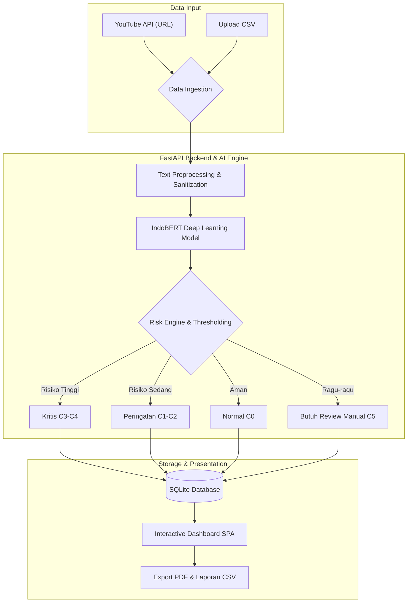

# CyberGuard-ID


🚀 **Live Demo:** [https://cyberguard-id.onrender.com](https://cyberguard-id.onrender.com)

**Platform Skrining dan Prioritisasi Moderasi Komentar YouTube Indonesia Berbasis AI/ML.**

CyberGuard-ID dirancang untuk membantu kreator konten, agensi, dan tim moderasi dalam menyaring, mengkategorisasikan, dan memprioritaskan penanganan komentar berbahaya (ujaran kebencian, bahasa kasar, ancaman) serta mendeteksi serangan terkoordinasi/bot repetitif pada kolom komentar video YouTube.

---

## Transparansi Komponen Sistem

Untuk memastikan integritas akademik dan memperjelas batasan fungsionalitas sistem, tabel berikut merinci komponen mana yang menggunakan metode deterministik, mana yang merupakan model *Machine Learning* yang dilatih sendiri, dan mana yang menggunakan bantuan LLM via API. Pendekatan ini mencegah *overclaiming* atas kapabilitas AI pada proyek ini:

| Komponen / Fungsionalitas | Pendekatan | Deskripsi Implementasi |
|---------------------------|------------|------------------------|
| **Text Preprocessing** | Deterministik / Rule-Based | Regex (hapus URL/mention) dan pemetaan kamus (slang translation). |
| **Deteksi Spam / Bot** | Deterministik / Statistik | Algoritma *MinHash LSH* dan *TF-IDF Cosine Similarity* untuk mendeteksi kemiripan teks. |
| **Klasifikasi Teks (C0-C4)** | **ML Terlatih (Deep Learning)** | Model bahasa **IndoBERT** yang **di-fine-tune secara mandiri** menggunakan framework PyTorch pada dataset spesifik. Bukan menggunakan *prompting* LLM. |
| **Confidence Scoring (C5)**| Deterministik / Logika | Penentuan label "Tidak Pasti" (C5) berdasarkan *softmax probability thresholding* dari output IndoBERT. |
| **Ringkasan Eksekutif** | LLM-Assisted (API) | Penggunaan Google Gemini API secara spesifik HANYA untuk membuat narasi ringkasan eksekutif dari laporan agregat akhir, BUKAN untuk klasifikasi komentar individual. |

---

## Keamanan & Pengelolaan Secrets

> [!WARNING]
> **JANGAN PERNAH** melakukan commit file `.env` atau kunci API ke dalam *version control* (Git). Segala token rahasia (seperti `YOUTUBE_API_KEY` dan `GEMINI_API_KEY`) hanya boleh disimpan secara lokal di mesin masing-masing dalam file `.env`. Repositori ini telah menyediakan file `.env.example` sebagai referensi konfigurasi dan telah mengecualikan `.env` secara eksplisit dalam `.gitignore` demi keamanan.

---

## Arsitektur Sistem

Aplikasi ini menggunakan arsitektur **Decoupled Client-Server**:

- **Model Utama**: **IndoBERT** (`indobenchmark/indobert-base-p1`) — inferensi via **ONNX Runtime** (quantized int8, hemat memori ~700 MB)
- **Alur Inti**: YouTube URL Input → Preprocessing → Klasifikasi → Confidence Thresholding → Dashboard Hasil → Export PDF/CSV

### Workflow & Data Pipeline


### Struktur Direktori

```
cyberguard-id/
├── server/                     # FastAPI Backend Application
│   ├── main.py                 # FastAPI app entry point & static file server
│   ├── dependencies.py         # Singleton dependency injection
│   └── api/
│       ├── analysis.py         # Analisis YouTube + real-time SSE progress
│       ├── reports.py          # Generator & download laporan (PDF, CSV)
│       └── system.py           # Health check & schema taksonomi label
│
├── frontend/                   # Modern SPA Frontend (No build step required)
│   ├── index.html              # Shell HTML utama
│   ├── css/style.css           # Design system (Adaptif, Multiplatform, Dark Mode)
│   └── js/
│       ├── app.js              # SPA Router & state manager
│       ├── api.js              # Fetch client & SSE wrapper
│       ├── components/         # Reusable UI (Toast, Progress, Charts, DataTable)
│       └── pages/              # Halaman SPA (Home, Results)
│
├── src/                        # Core Engine & Services
│   ├── core/                   # Schemas, Config, Exceptions, Logging
│   ├── services/               # Preprocessor, Classifier, Repetition, Risk, YouTube, Reports, Storage
│   └── workflow/               # Analysis Orchestration Engine
│
├── scripts/                    # Script Training, Evaluasi & Konversi Model
│   ├── train_bert.py           # Fine-tuning IndoBERT
│   ├── evaluate_model.py       # Evaluasi model pada test set
│   └── convert_to_onnx.py      # Konversi PyTorch → ONNX + int8 quantization
│
├── config/                     # Konfigurasi Taksonomi & Model (YAML)
├── models/                     # Model Klasifikasi (IndoBERT ONNX Quantized) & Metadata
├── data/                       # Dataset (raw/, processed/, sample/)
├── artifacts/                  # Database SQLite, Hasil Analisis & Laporan
├── requirements.txt            # Dependensi runtime (inference)
├── requirements-train.txt      # Dependensi training (PyTorch, HuggingFace)
└── run.py                      # One-command cross-platform launcher
```

---

## Taksonomi Kategori Label (C0–C5)

Sistem menggunakan 6 kategori klasifikasi (5 kategori model terlatih + 1 kategori ketidakpastian):

| Kode | Label | Deskripsi | Base Score | Risk Level |
|------|-------|-----------|------------|------------|
| C0 | **Normal** | Komentar biasa, apresiasi, pertanyaan, diskusi | 0 | Low |
| C1 | **Abusive** | Makian/kata kasar tanpa target individu langsung | 1 | Low–Medium |
| C2 | **Hate Speech Lemah** | Ujaran kebencian ringan, penghinaan berisiko rendah | 2 | Medium |
| C3 | **Hate Speech Sedang** | Serangan agresif, diskriminatif, pencemaran nama baik | 3 | High |
| C4 | **Hate Speech Kuat** | Ancaman kekerasan, rasisme, radikalisme ekstrem | 4 | High–Critical |
| C5 | **Tidak Pasti** | Ambigu, memerlukan *human review* *(bukan kelas training)* | — | — |

---

## Metodologi Machine Learning

### 1. Dataset

Dataset terdiri dari komentar YouTube berbahasa Indonesia yang dianotasi secara manual sesuai taksonomi C0–C4 di atas.

- **Format**: CSV dengan kolom `text` dan `label`
- **Split**: 70% training / 15% validasi / 15% test (stratified per kelas)
- **Preprocessing**: Lowercase, normalisasi unicode, penghapusan URL/mentions, normalisasi slang, normalisasi karakter berulang

Lihat `data/raw/README.md` dan `data/processed/README.md` untuk detail format.

### 2. Model: IndoBERT Fine-Tuning

Model dasar yang digunakan adalah **`indobenchmark/indobert-base-p1`** — BERT pre-trained khusus untuk Bahasa Indonesia dengan 12 layer transformer, 768 hidden units, dan 110M parameter.

**Arsitektur fine-tuning:**
```
indobenchmark/indobert-base-p1
└── BertForSequenceClassification
    └── classifier head (768 → 5 classes)
```

**Hyperparameter Training:**

| Parameter | Nilai |
|-----------|-------|
| Base model | indobenchmark/indobert-base-p1 |
| Max sequence length | 128 token |
| Batch size | 16 |
| Learning rate | 2e-5 |
| Epochs | 3 |
| Weight decay | 0.01 |
| Evaluation strategy | per epoch |
| Best model metric | macro F1 |
| Optimizer | AdamW |

**Jalankan training:**
```bash
pip install -r requirements-train.txt
python scripts/train_bert.py
```

### 3. ONNX Quantization

Setelah fine-tuning, model dikonversi ke **ONNX format** dan di-quantize ke **int8 dynamic quantization** menggunakan HuggingFace Optimum:

- Model PyTorch (~440 MB) → ONNX (~440 MB) → ONNX int8 (~110 MB)
- Pengurangan ukuran model: ~75%
- RAM savings: ~700 MB (tidak memerlukan PyTorch/CUDA di runtime)
- Inferensi menggunakan ONNX Runtime (CPU-only)

```bash
python scripts/convert_to_onnx.py
```

### 4. Inference Pipeline

Setiap komentar melewati pipeline berikut:
1. **Text Preprocessing** — normalisasi teks, slang dictionary, emoji removal
2. **IndoBERT ONNX** — tokenisasi + inferensi, menghasilkan probabilitas C0–C4
3. **Context Disambiguator** — koreksi konteks (slang positif, kritik konstruktif)
4. **Confidence Thresholding** — label C5 (uncertain) jika confidence < threshold
5. **Adaptive Learning** — override dengan label yang pernah dikoreksi manusia
6. **Risk Engine** — skor risiko berdasarkan kategori + faktor kontekstual

### 5. Hasil Evaluasi Model

Evaluasi dilakukan pada held-out test set menggunakan model IndoBERT ONNX int8:

| Metrik | Nilai |
|--------|-------|
| **Accuracy** | 81.08% |
| **Macro F1** | 76.82% |
| Model size (ONNX int8) | ~110 MB |
| Inference time | <100ms / komentar |

#### Performa per Kelas (Contoh)
| Kelas | Precision | Recall | F1-Score | Support |
|-------|-----------|--------|----------|---------|
| C0 (Normal) | - | - | - | - |
| C1 (Abusive) | - | - | - | - |
| C2 (Hate Speech Lemah) | - | - | - | - |
| C3 (Hate Speech Sedang) | - | - | - | - |
| C4 (Hate Speech Kuat) | - | - | - | - |

#### Confusion Matrix (Contoh)
```
                          Prediksi
                 C0    C1    C2    C3    C4
              -----------------------------
          C0 |   -     -     -     -     - 
 Aktual   C1 |   -     -     -     -     - 
          C2 |   -     -     -     -     - 
          C3 |   -     -     -     -     - 
          C4 |   -     -     -     -     - 
```
*(Catatan: Lakukan training dan evaluasi ulang untuk mengisi metrik di atas berdasarkan model terbaru)*

> [!TIP]
> Jalankan `python scripts/evaluate_model.py` untuk mendapatkan metrik lengkap per kelas pada test set Anda.

---

## Panduan Penggunaan Cepat

### 1. Prasyarat
- Python 3.10+
- (Opsional) Google YouTube Data API v3 Key
- (Opsional) Google Gemini API Key (untuk ringkasan eksekutif AI)

### 2. Menjalankan Aplikasi
```bash
python run.py
```

Perintah ini akan secara otomatis:
1. Menyiapkan virtual environment `.venv` jika belum ada
2. Menginstal seluruh dependensi dari `requirements.txt`
3. Menginisialisasi basis data SQLite dan struktur folder
4. Menjalankan server di **http://localhost:8001**

### 3. Konfigurasi Lingkungan (`.env`)
```ini
YOUTUBE_API_KEY=your_youtube_api_key_here
GEMINI_API_KEY=your_gemini_api_key_here
GEMINI_MODEL=gemini-2.5-flash
ANONYMIZATION_SALT=rahasia-salt-unik
APP_PORT=8001
LOG_LEVEL=INFO
```

---

## Perintah CLI & Otomatisasi

| Perintah | Deskripsi |
|----------|-----------|
| `python run.py` | Menjalankan server web di port 8001 |
| `python run.py --test` | Menjalankan unit test & integration test suite |
| `python run.py --check` | Menjalankan audit kesehatan dan konfigurasi sistem |
| `python scripts/train_bert.py` | Fine-tuning ulang model IndoBERT *(butuh `requirements-train.txt`)* |
| `python scripts/convert_to_onnx.py` | Konversi model PyTorch ke ONNX int8 quantized |
| `python scripts/evaluate_model.py` | Evaluasi model ONNX pada test set dengan metrik lengkap |

---

## Dokumentasi REST API

Setelah server berjalan:
- **Swagger UI**: [http://localhost:8001/api/docs](http://localhost:8001/api/docs)
- **ReDoc**: [http://localhost:8001/api/redoc](http://localhost:8001/api/redoc)

---

## Fitur Utama

- **Klasifikasi 5 Kelas**: IndoBERT fine-tuned untuk taksonomi C0–C4 spesifik konteks YouTube Indonesia
- **Confidence Thresholding**: Prediksi ambigu (C5) diarahkan ke human review, bukan dipaksakan
- **Deteksi Serangan Terkoordinasi**: MinHash LSH / TF-IDF Cosine Similarity untuk deteksi bot/spam brigade
- **Adaptive Learning**: Koreksi label oleh manusia tersimpan dan digunakan untuk prediksi selanjutnya
- **Risk Scoring**: Skor risiko transparan dan auditabel, menggabungkan severity kategori + faktor kontekstual
- **Export Laporan**: HTML, CSV, dan JSON untuk keperluan audit dan tindak lanjut
