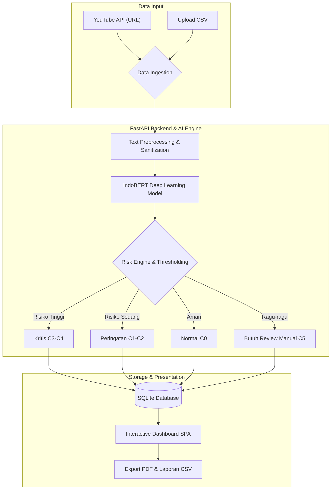

# CyberGuard-ID

🚀 **Live Demo:** [https://cyberguard-id.onrender.com](https://cyberguard-id.onrender.com)

**Platform Skrining dan Prioritisasi Moderasi Komentar YouTube Indonesia Berbasis AI/ML.**

CyberGuard-ID dirancang untuk membantu kreator konten, agensi, dan tim moderasi dalam menyaring, mengkategorisasikan, dan memprioritaskan penanganan komentar berbahaya (ujaran kebencian, bahasa kasar, ancaman) serta mendeteksi serangan terkoordinasi/bot repetitif pada kolom komentar video YouTube.

---

## Fitur Utama

- **Klasifikasi 5 Kelas**: IndoBERT fine-tuned untuk taksonomi C0–C4 spesifik konteks YouTube Indonesia
- **Confidence Thresholding**: Prediksi ambigu (C5) diarahkan ke human review, bukan dipaksakan
- **Deteksi Serangan Terkoordinasi**: MinHash LSH / TF-IDF Cosine Similarity untuk deteksi bot/spam brigade
- **Adaptive Learning**: Koreksi label oleh manusia tersimpan dan digunakan untuk prediksi selanjutnya
- **Risk Scoring**: Skor risiko transparan dan auditabel, menggabungkan severity kategori + faktor kontekstual
- **Export Laporan**: HTML, CSV, dan JSON untuk keperluan audit dan tindak lanjut

---

## Arsitektur Sistem

Aplikasi ini menggunakan arsitektur **Decoupled Client-Server**:

- **Model Utama**: **IndoBERT** (`indobenchmark/indobert-base-p1`) — inferensi via **ONNX Runtime** (quantized int8, hemat memori ~700 MB)
- **Alur Inti**: YouTube URL Input → Preprocessing → Klasifikasi → Confidence Thresholding → Dashboard Hasil → Export PDF/CSV

### Workflow & Data Pipeline


---

## Taksonomi Kategori Label (C0–C5)

Sistem menggunakan 6 kategori klasifikasi (5 kategori model terlatih + 1 kategori ketidakpastian):

| Kode | Label | Deskripsi | Base Score | Risk Level |
|------|-------|-----------|------------|------------|
| C0 | **Normal** | Komentar biasa, apresiasi, pertanyaan, diskusi | 0 | Low |
| C1 | **Abusive** | Makian/kata kasar tanpa target individu langsung | 1 | Low–Medium |
| C2 | **Hate Speech Lemah** | Ujaran kebencian ringan, penghinaan berisiko rendah | 2 | Medium |
| C3 | **Hate Speech Sedang** | Serangan agresif, diskriminatif, pencemaran nama baik | 3 | High |
| C4 | **Hate Speech Kuat** | Ancaman kekerasan, rasisme, radikalisme ekstrem | 4 | High–Critical |
| C5 | **Tidak Pasti** | Ambigu, memerlukan *human review* *(bukan kelas training)* | — | — |

---

## Model Evaluation V1 (Internal Baseline)

Dokumentasi model awal versi pertama (V1) yang dilatih menggunakan dataset internal. Evaluasi dilakukan dengan pipeline: *preprocessing* → *classification* → *confidence thresholding* → *dashboard*.
- **Model**: IndoBERT (fine-tuning nyata)
- **Epoch**: 3
- **Accuracy**: 81.0797%
- **Macro F1**: 0.76817
- **Artifact**: `model.safetensors`

*(Catatan: V1 dan V2 dievaluasi menggunakan dataset yang berbeda, sehingga metrik V1 dan V2 tidak dapat dibandingkan secara langsung).*

---

## Model Revision Experiments V2

Dokumentasi eksperimen revisi (V2) dilakukan untuk menindaklanjuti rekomendasi perbaikan model (*class balancing*, augmentasi data, *hyperparameter*). **Rekomendasi utama telah ditindaklanjuti, tetapi target awal >85% accuracy masih belum tercapai, dan eksperimen tambahan seperti *Learning Rate tuning* berulang atau penggunaan model yang lebih besar tidak dijadikan eksperimen final.**

Seluruh perbandingan eksperimen di bawah ini (A-C) dievaluasi murni menggunakan **validation set**.

### A. Dataset Eksperimen Revisi V2 — Ibrohim & Budi (2019)
- **Total Data**: 13.169 teks
- **Domain**: Twitter/X
- **Bahasa**: Indonesia
- **Alasan Pemilihan**: Menyediakan label *abusive* dan *severity hate speech* yang kompatibel dengan taxonomy CyberGuard-ID.
- **Mapping Label**: 
  - C0 = `normal`
  - C1 = `abusive`
  - C2 = `hate_speech_weak`
  - C3 = `hate_speech_moderate`
  - C4 = `hate_speech_strong`
- **Distribusi Total**: C0 (5.860), C1 (1.748), C2 (3.383), C3 (1.705), C4 (473).
- **Split Dataset** (Stratified, Random seed=42): 
  - Train: 9.218
  - Validation: 1.975
  - Test: 1.976

### B. Reproducibility & Class Balancing
Sebagai implementasi penanganan *class imbalance*, eksperimen *baseline* revisi ini menggunakan **Weighted Cross-Entropy** dengan bobot kelas: C0=0.4494, C1=1.5062, C2=0.7785, C3=1.5453, C4=5.5697.
- **Base Model**: `indobenchmark/indobert-base-p1`
- **Random Seed**: 42, **LR**: 2e-5, **Batch Size**: 16, **Max Length**: 128
- **Metric Selection**: Macro F1

### C. Baseline Revisi V2 — Weighted Cross-Entropy
Eksperimen training dijalankan hingga maksimal 3 epoch:
- **Epoch 1**: Eval Loss 0.6049, Accuracy 0.8010, Macro F1 0.7734
- **Epoch 2**: Eval Loss 0.5921, Accuracy 0.7898, Macro F1 0.7618
- **Epoch 3**: Eval Loss 0.6731, Accuracy 0.8040, Macro F1 0.7682

**Best Checkpoint** berada pada **Epoch 1 / Step 577**. Evaluasi pada Validation set:
- **Accuracy** = 80.10%, **Macro F1** = 77.34%

| Class | Precision | Recall | F1 | Support |
|-------|-----------|--------|----|---------|
| C0 | 0.9271 | 0.8680 | 0.8966 | 879 |
| C1 | 0.6917 | 0.7023 | 0.6970 | 262 |
| C2 | 0.7323 | 0.7771 | 0.7541 | 507 |
| C3 | 0.6558 | 0.7070 | 0.6805 | 256 |
| C4 | 0.8333 | 0.8451 | 0.8392 | 71 |

**Confusion Matrix (Baseline):**
```
Pred C0 C1 C2 C3 C4
True C0 763 38 43 33 2
True C1 17 184 50 11 0
True C2 25 40 394 44 4
True C3 18 4 47 181 6
True C4 0 0 4 7 60
```
**Analisis Evaluasi:** C0 dan C4 terdeteksi dengan relatif kuat. Sebaliknya, C1 dan terutama C3 memiliki F1 paling rendah. Confusion terbesar berada pada *boundary* yang tipis antara C1, C2, dan C3 (Contoh: C1→C2=50, C2→C1=40, C2→C3=44, C3→C2=47). Hal ini membuktikan asumsi bahwa C4 adalah kelas terburuk (hanya karena jumlah datanya kecil) adalah salah.

### D. Focal Loss Experiment
Diuji penggunaan **Alpha-Balanced Focal Loss** (gamma=2) sebagai strategi alternatif *class imbalance*.
- **Sanity-check implementasi**: Weighted CE (2.19430447) vs Focal Loss gamma=0 (2.19430447). Selisih = 0.0.
- **Hasil Validation**: Accuracy = 80.41%, Macro F1 = 76.85%.
- **Per-class F1**: C0=90.57%, C1=71.63%, C2=74.34%, C3=68.53%, C4=79.19%.
- **Kesimpulan**: Focal Loss menaikkan Accuracy sedikit serta F1 pada C1 dan C3. Akan tetapi, nilai Macro F1 secara keseluruhan turun akibat kelas C4. Oleh karena itu, Focal Loss tidak digunakan sebagai metode final.

### E. Quality-Controlled Augmentation Experiments (Ditolak)
Saran *data augmentation* telah dieksplorasi secara nyata (*Contextual MLM* & *Protected-token MLM*). Namun, metode ini **ditolak ketat** saat QC karena menyebabkan *semantic/label corruption*, memunculkan token `[UNK]`, dan mengubah makna kata secara fundamental (contoh: "bangsat" → "dong"). Skrip augmentasi tidak dipaksakan demi integritas eksperimen.

### F. Final Model Selection
Berdasarkan eksperimen di atas, kami secara resmi melakukan *freeze* terhadap **Baseline Weighted Cross-Entropy (Epoch 1 / Step 577)** sebagai model final sebelum pengujian terhadap *Test Set* dibuka.

---

## Capstone Revision — Verified Retraining

Bagian ini ditambahkan untuk menjawab kritik reviewer secara spesifik dan transparan.
*   **Kritik Reviewer**: Reviewer menyoroti bahwa pada revisi sebelumnya, meskipun kode pipeline telah diperbarui, file metrik (`models/model_metadata.json`) tidak berubah dan masih menampilkan hasil lama. Reviewer meragukan apakah model telah benar-benar diretrain, dan meminta agar retraining dieksekusi serta dilaporkan secara transparan.
*   **Tindakan**: Retraining (Revision V2) benar-benar dieksekusi secara penuh dari *scratch* (base model `indobenchmark/indobert-base-p1`). Seluruh checkpoint, model size (474MB), timestamp, dan hash SHA-256 telah diaudit sebagai bukti retraining yang diverifikasi.
*   **Konfigurasi**: Retraining ini secara eksplisit menggunakan *Class Weighting* murni pada *Cross-Entropy Loss* untuk menangani *imbalance* (tanpa memaksakan *data augmentation* yang rawan merusak integritas *hate speech*). Augmentasi yang sebelumnya disiapkan tidak digunakan pada retraining final setelah quality audit menemukan risiko perubahan semantik/label; retraining final menggunakan class weighting untuk menjaga integritas ground truth.
*   **Hasil Validation (Best Checkpoint: Epoch 1, Step 577)**:
    *   **Validation Accuracy**: 80.20%
    *   **Validation Macro F1**: 77.61%
*   **Per-Class Metrics (Precision/Recall/F1/Support)**:
    *   `normal` (C0): 0.9273 / 0.8703 / 0.8979 / 879
    *   `abusive` (C1): 0.6352 / 0.7710 / 0.6966 / 262
    *   `hate_speech_weak` (C2): 0.7656 / 0.7278 / 0.7462 / 507
    *   `hate_speech_moderate` (C3): 0.6800 / 0.7305 / 0.7043 / 256
    *   `hate_speech_strong` (C4): 0.8133 / 0.8592 / 0.8356 / 71
*   **Kesimpulan Objektif**:
    *   Secara eksplisit, **target >85% Accuracy masih belum tercapai**.
    *   Berdasarkan evaluasi di atas, **C1/C2/C3 pada eksperimen Revision V2 menunjukkan performa lebih rendah / lebih sulit dibedakan** (F1 berada di kisaran ~70%) dibandingkan mendeteksi ujaran ekstrem **C4** (F1 83.56%), meskipun data C4 paling sedikit.
    *   **V1 dan Revision V2 tidak dibandingkan sebagai A/B testing langsung**, karena setup *evaluation split*-nya tidak sama. Revision V2 murni bertujuan menyediakan *verified retraining metadata* demi transparansi.

---

## Final Held-Out Test Evaluation V2

*(Satu kali pengujian unbiased yang hanya dilakukan setelah model dipilih menggunakan validation set. Pengujian ini menggunakan `data/processed/test.csv`).*

| Metrik Keseluruhan | Nilai |
|--------------------|-------|
| **Test Accuracy** | 76.97% |
| **Test Macro F1** | 74.16% |

**Performa per Kelas (Final Test):**
| Class | Precision | Recall | F1 | Support |
|-------|-----------|--------|----|---------|
| C0 | 0.9060 | 0.8441 | 0.8740 | 879 |
| C1 | 0.7011 | 0.7252 | 0.7129 | 262 |
| C2 | 0.6857 | 0.7087 | 0.6970 | 508 |
| C3 | 0.5972 | 0.6719 | 0.6324 | 256 |
| C4 | 0.7808 | 0.8028 | 0.7917 | 71 |

**Confusion Matrix (Final Test):**
```
Pred C0 C1 C2 C3 C4
True C0 742 38 64 35 0
True C1 14 190 50 8 0
True C2 36 36 360 64 12
True C3 26 6 48 172 4
True C4 1 1 3 9 57
```

---

## Limitations

- **Domain Shift**: Dataset pelatihan V2 berasal dari Twitter/X (Ibrohim & Budi), sedangkan aplikasi ini ditujukan untuk filter komentar YouTube. Potensi *domain shift* (perbedaan budaya bahasa) ini adalah keterbatasan alami proyek.
- **Target Akurasi Belum Tercapai**: Target proyek >85% *Accuracy* (maupun *Macro F1*) belum tercapai. Meskipun berbagai pendekatan eksperimen telah dilakukan, kompleksitas gradasi ujaran kebencian bahasa Indonesia menyebabkan batas performa model pada *unbiased test set* tetap berada di bawah target.

---

## Panduan Penggunaan Cepat

### 1. Prasyarat
- Python 3.10+
- (Opsional) Google YouTube Data API v3 Key
- (Opsional) Google Gemini API Key (untuk ringkasan eksekutif AI)

### 2. Menjalankan Aplikasi
```bash
python run.py
```

Perintah ini akan secara otomatis:
1. Menyiapkan virtual environment `.venv` jika belum ada
2. Menginstal seluruh dependensi dari `requirements.txt`
3. Menginisialisasi basis data SQLite dan struktur folder
4. Menjalankan server di **http://localhost:8001**

### 3. Konfigurasi Lingkungan (`.env`)
Buat file `.env` di root direktori dengan struktur:
```ini
YOUTUBE_API_KEY=your_youtube_api_key_here
GEMINI_API_KEY=your_gemini_api_key_here
GEMINI_MODEL=gemini-2.5-flash
ANONYMIZATION_SALT=rahasia-salt-unik
APP_PORT=8001
LOG_LEVEL=INFO
```

---

## Perintah CLI & Otomatisasi

| Perintah | Deskripsi |
|----------|-----------|
| `python run.py` | Menjalankan server web di port 8001 |
| `python run.py --test` | Menjalankan unit test & integration test suite |
| `python run.py --check` | Menjalankan audit kesehatan dan konfigurasi sistem |
| `python scripts/train_bert.py` | Fine-tuning ulang model IndoBERT *(butuh `requirements-train.txt`)* |
| `python scripts/convert_to_onnx.py` | Konversi model PyTorch ke ONNX int8 quantized |
| `python scripts/evaluate_model.py` | Evaluasi model ONNX pada test set dengan metrik lengkap |

---

## Dokumentasi REST API

Setelah server berjalan:
- **Swagger UI**: [http://localhost:8001/api/docs](http://localhost:8001/api/docs)
- **ReDoc**: [http://localhost:8001/api/redoc](http://localhost:8001/api/redoc)

---

## Keamanan & Pengelolaan Secrets

> [!WARNING]
> **JANGAN PERNAH** melakukan commit file `.env` atau kunci API ke dalam *version control* (Git). Repositori ini mengecualikan file `.env`, konfigurasi rahasia, environment lokal (seperti `.venv`), dataset raw, dan bobot checkpoint eksperimen secara eksplisit melalui `.gitignore`. Model canonical dapat dipertahankan menggunakan Git LFS.
